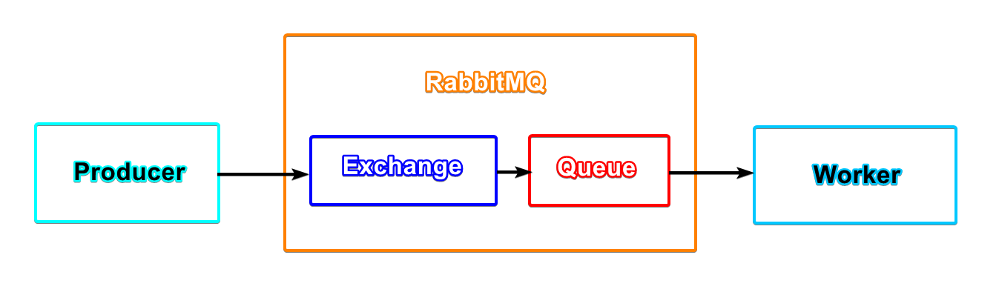

# Hozon

## Introduction

Hozon (保存), meaning "preserve" in Japanese, is an application for archiving images that are posted on social media platforms by any public user.

## WIP features

- Keep archive up-to-date
- Store archive in remote storage

## Supported platforms

- Artstation
- Instagram
- Pixiv
- Twitter

## Getting Started

Hozon consists of 2 components:

1. **Scraper**: finds the download link of the image.
2. **Downloader**: downloads the image.

The way that the *scraper* talks to the *downloader* is through **RabbitMQ**, which is message broker.

RabbitMQ receives messages from Producer(s), and distributes them to Worker(s).

Looking at the above diagram, the *scraper* is the *producer*, and the *downloader* is the *worker*. The scraper, the downloader, and the RabbitMQ server can be deployed in the same or in different machines.

There are in total 3 things that need to be setup (recommended order):

1. RabbitMQ: documentation can be found in its respective folder [here](rabbitmq/README.md).
2. Scraper: documentation can be found in its respective folder [here](scraper/README.md).
3. Downlader: documentation can be found in its respective folder [here](downloader/README.md).
